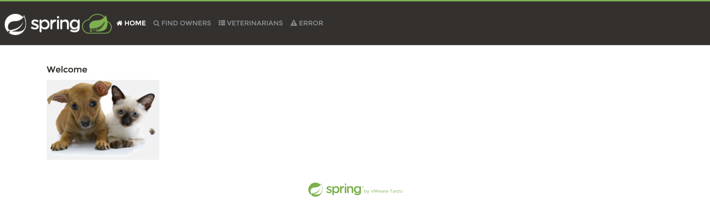
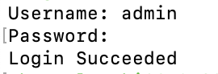
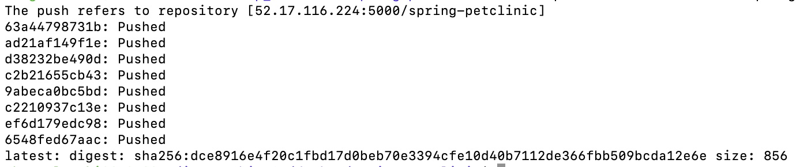
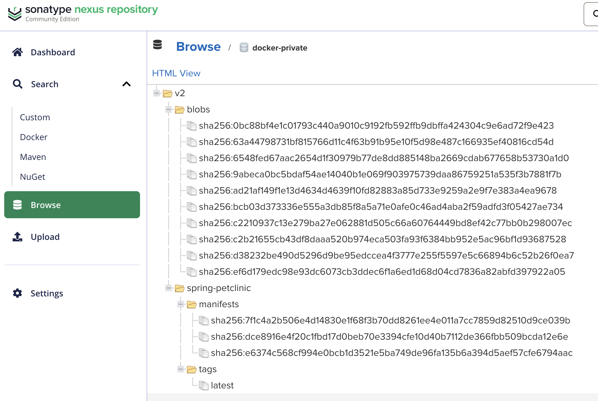
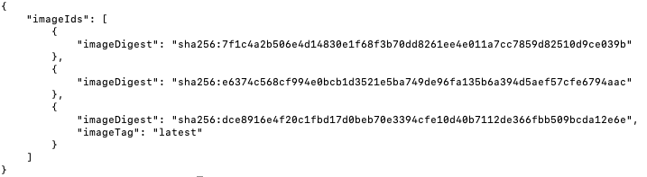
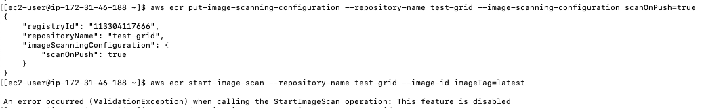

# Docker practical tasks

## Practical Task 1
## Fork GitHub - spring-projects/spring-petclinic: A sample Spring-based application 

Done.

## Create Dockerfile for Spring-petclinic application using pre-built artifact

### Build application outside of container

Done:

```bash
./mvnw package
```

Jarfile is under this directory:

```
spring-petclinic/target/spring-petclinic-3.5.0-SNAPSHOT.jar.original
```


### Copy artifact from target folder into image and make it work inside container

Dockerfile:

```Dockerfile
FROM eclipse-temurin:21-jdk-jammy
WORKDIR /app
COPY ./target/spring-petclinic-3.5.0-SNAPSHOT.jar.original .
EXPOSE 8080
ENTRYPOINT ["java", "-jar", "spring-petclinic-3.5.0-SNAPSHOT.jar"]
```

Container works fine:

<p align="center">  </p>

---

## Create multi-stage Dockerfile for Spring-petclinic application

```Dockerfile
FROM maven:3.9.6-eclipse-temurin-17 as build
WORKDIR /build
COPY . .
RUN ./mvnw package

FROM eclipse-temurin:21-jdk-jammy
WORKDIR /app
COPY --from=build /build/target/spring-petclinic-*.jar app.jar
EXPOSE 8080
ENTRYPOINT ["java", "-jar", "app.jar"]
```

Done. Works fine

---

## Create docker-compose configuration that will automatically start multiple containers

File `docker-compose.yaml`:

```Dockerfile
version: '3.8'

services:
  petapp:
    build: .
    depends_on:
      - mysql
    ports:
      - "8080:8080"
    environment:
      SPRING_DATASOURCE_URL: jdbc:mysql://mysql:3306/petclinic
      SPRING_DATASOURCE_USERNAME: petclinic
      SPRING_DATASOURCE_PASSWORD: petclinic

  mysql:
    image: mysql:8.0
    ports:
      - "3306:3306"
    environment:
      MYSQL_ROOT_PASSWORD: rootpass
      MYSQL_USER: petclinic
      MYSQL_PASSWORD: petclinic
      MYSQL_DATABASE: petclinic
```

Done. Works.

---
---

## Practical task 2

### Uploading docker images to Nexus and ECR

Run nexus registry:

```bash
nexus run
```

#### Create and configure docker repository in Nexus

Created a `docker-private` (hosted) repository.

Initially, I encountered repeated errors when connecting to the local registry:

```
WARNING! Using --password via the CLI is insecure. Use --password-stdin.
Error response from daemon: Get "https://localhost:8083/v2/": context deadline exceeded (Client.Timeout exceeded while awaiting headers)
```

To resolve this, I deployed Nexus on an Ubuntu server in AWS — this worked:

<p align="center">  </p>


#### Upload spring-petclinic image to Nexus

Uploaded:

<p align="center">  </p>

In Nexus:

<p align="center">  </p>

#### Create and configure repository in ECR

Configured AWS CLI using access keys (IAM > Users), then followed official AWS guide to create the repository.

Successfully pushed the `spring-petclinic` image:

<p align="center">  </p>

### Perform security scan for uploaded images in ECR

Firstly I had to configure AWS CLI using `aws configure`.

Then we can create repository ECR using:

```
aws ecr create-repository \
  --repository-name spring-petclinic \
  --image-scanning-configuration scanOnPush=true
```

Next, copy the URI of this repository. It should look like this:

```
<accountID>.dkr.ecr.<region>.amazonaws.com/<repo-name>
```

On your local machine, log in to the repository using:

```
aws ecr get-login-password --region <region> | docker login --username AWS --password-stdin <accountID>.dkr.ecr.<region>.amazonaws.com/<repo-name>
```

After a successful login, build the Docker image, tag it using the repository URI, and push it:

```
docker tag <my-image> <accountID>.dkr.ecr.<region>.amazonaws.com/<repo-name>:<your-tag>

docker push <accountID>.dkr.ecr.<region>.amazonaws.com/<repo-name>:<your-tag>
```

To show images in the repository:

```
aws ecr describe-images \
  --repository-name <repo-name>
```


Although `ScanOnPush` is set to `True`, scan functionality is not working — possibly due to permissions. There's no **Scan** button:

<p align="center">  </p>

Scan status is **Failed**:

<p align="center">  </p>